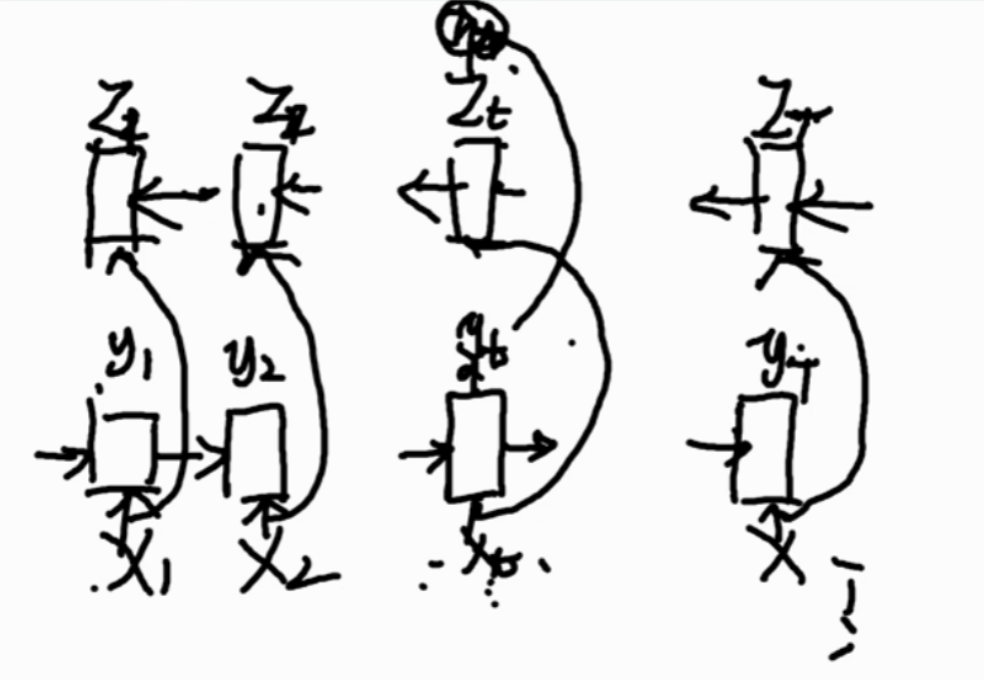

# 神经网络结构

- 全连接网络 
  - $h^{l+1}=f(h^l\cdot W)$
  - 样本x
- 神经网络在表示信息、特征、样本是用**向量**表示的。

# 上课思路

- 输入数据
- 模型
- 损失函数

# 安排

- 循环神经网络产生原因
- 神经网络基础结构
- 实例
  - 文本分类（有顺序的）
  - 文本生成
- 练习：文本分词

# 文本向量化

- Embedding （为了使短向量表示长向量）
  - 给每个字单独编号，编号是连续的，共有n个字 
  - onehot编码：得到长度为n的向量v
  - 降维：线性降维 x=vW 

# 基础循环神经网络

- yt=f(xtW1+yt-1 W2)
- y=f(concat(x,y)W)

# 文本分类任务

- 一维连续数据:[BatchSize, Time, Feature]
  - 文本
  - 信号 

# 文本生成

- 给定首字，拓展为一句诗。 
- 输入：象纱笼玉指，缕金罗扇轻。
- 标签：纱笼玉指，缕金罗扇轻。\n
- 训练模型流程：
  - step1:Embedding
    - 输入：[BatchSize, Time]整形数字
    - 输入：[BatchSize, Time, Feature1]浮点类型
  - step2:RNN
    - 输入：[BatchSize, Time, Feature1]浮点类型
    - 输出：[BatchSize, Time, Feature2]浮点类型
  - step3:Dense 
    - 输入：[BatchSize, Time, Feature2]浮点类型
    - 输出：[BatchSize, Time, 类别数]浮点类型
  - step4:Sequence_loss 
- 预测过程
  - step1:首词ID
  - step2:Embedding向量x1
  - step3:RNN
    - 输入：x1, s0
    - 输出：每个字的概率
  - step4:获取第二个字的ID
    - 方法1：贪心算法-选择当前概率最大的字
    - 方法2：随机方法-根据概率选择字 
    - 方法3：全局最优-改进-BeamSearch选择概率最大的n（BeamWidth）个序列
  - step5:将获取的第二个字输入回RNN里循环这个过程
  - seep6:检测到结束符号终止(限制最大步长)。

# 文本分词

- 输入：今天的天气不错
- 标签：B E S B M M E
- 两层RNN
- 双向RNN (难训练，无法做到实时性，因为要获取最后一个时间步)

LSTM要解决的问题是 长期依赖，而分词不需要那么长的依赖。

可能出现前几个词分词的效果不好，

RNN的Dropout只在层与层之间进行，单层RNN内不进行dropout