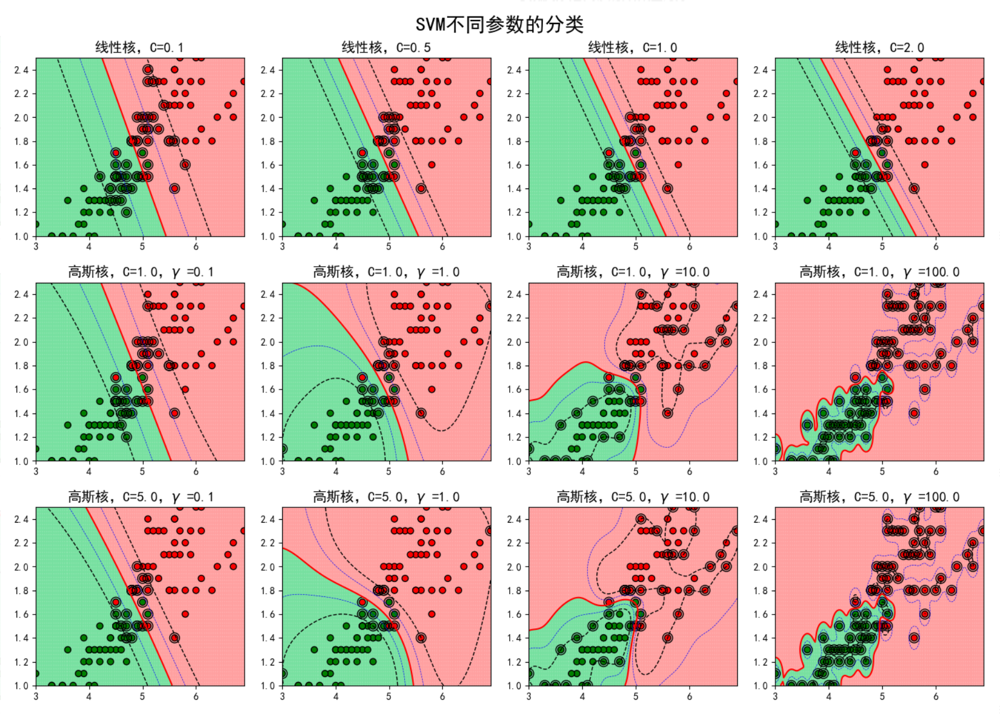

## 原理

求解能够正确划分训练数据集并且几何间隔最大的分离超平面

目标超平面$w\cdot x+b$，使到这个超平面几何距离最近的样本点 到这个超平面的几何距离都尽可能的大。

数学约束：
$$
y(x\cdot w + b \ge 1) \\
D=\frac{1}{\sqrt{w^2}}
$$
$D$是指支持向量到超平面的距离
$$
\min \, \frac{1}{2}w^2 \\
s.t. \,\,\,\,\, y_i(x_iw+b) \ge 1
$$

## 损失函数

$$
\max (1-d,0)
$$

## 核函数

1. 多项式核函数
   $$
   
   $$
   
2. 高斯核函数
   $$
   K(x,z)=(exp({-\frac{||x-z||^2}{2\sigma^2}})
   $$
   以$x$为中心做了一个指数级衰减，计算的是样本$x$和样本$z$之间的相似度如果$x$等于$z$那么结果就等于1，如果$x$和$z$相隔非常远那么二范数将会非常大，而最终的计算结果趋近于0。相当于以$x$为中心的一个高斯核函数（高斯分布）

   高斯核是无穷维的：
   $$
   \begin{align}
   K(x,z)&=(exp({-\frac{||x-z||^2}{2\sigma^2}})=e^{-\frac{x_1^2+x_2^2-2x_1x_2}{2\sigma^2}} = e^{-\frac{x_1^2+x_2^2}{2\sigma^2}} \cdot e^{-\frac{x_1x_2}{\sigma^2}} \\
   &=e^{-\frac{x_1^2+x_2^2}{2\sigma^2}} \cdot \left ( 1+\frac{1}{\sigma^2}\cdot \frac{x_1x_2}{1!} + (\frac{1}{\sigma^2})^2\cdot \frac{(x_1x_2)^2}{2!} \cdots +(\frac{1}{\sigma^2})^n\cdot \frac{x_1x_2}{n!} \right) \\
   &=e^{-\frac{x_1^2+x_2^2}{2\sigma^2}} \cdot \left ( 1\cdot 1+ \frac{1}{1!}  \cdot\frac{x_1}{\sigma}\cdot \frac{x_2}{\sigma} + \frac{1}{2!}  \cdot\frac{x_1}{\sigma^2}\cdot \frac{x_2}{\sigma^2} \cdots +\frac{1}{n!}  \cdot\frac{x_1}{\sigma^n}\cdot \frac{x_2}{\sigma^n} \right) \\
   &=\phi(x_1)^T \cdot \phi(x_2)
   \end {align}
   $$
   其中：$\phi(x)=e^{-\frac{x^2}{2\sigma^2}} \left( 1,\sqrt{\frac{1}{1!}}\frac{x}{\sigma}, \sqrt{\frac{1}{2!}}\frac{x^2}{\sigma^2},\cdots,\sqrt{\frac{1}{n!}}\frac{x^n}{\sigma^n} \right)$
   
   因为指数函数可以无穷阶泰勒展开，所以高斯核是无穷维的
   
3. 字符串核函数

##  合页损失

当样本点本准确分类且函数间隔大于1时，损失是0，否则损失是$1-y_i(w\cdot x_i +b)$。

## SVM调参

$C$：当C趋近于无穷大时：意味着分类严格不能有错误，越不容易欠拟合， 当C趋近于很小的时：意味着可以有更大的错误容忍，容易欠拟合

$\gamma$：

1. 如果Feature的数量很大，跟样本数量差不多，这时候选用LR或者是Linear Kernel的SVM（核函数需要计算内积，两两样本都得算，所以样本过多的话时间消耗太大，很明显高斯核比线性核复杂的多）
2. 如果Feature的数量比较小，样本数量一般，不算大也不算小，选用SVM+Gaussian Kernel
3. 如果Feature的数量比较小，而样本数量很多，需要手工添加一些feature变成第一种情况

## SVM和Logistic回归的比较

经典SVM直接输出类别，不给出后验概率

Logistic回归会给出属于哪个类别的后验概率

二者损失函数异同？

SVM框架下引入Logistic函数：输出条件后验概率

SVM用于回归问题：SVR

1. 计算复杂度不同。在推断时样本需要和每个支持向量进行计算，所以当模型非常复杂时 SVM的推断时间会特别长，甚至可能达到LR的几百倍。

2. 理论基础不同

    LR是用统计学中的极大似然估计推导的，而SVM其实是属于凸二次规划问题

3. LR能出输出概率值，而SVM不可以

4. LR是参数模型，SVM是非参数模型

5. SVM的决策面只与支持向量有关，而LR中所有的样本点都和决策面有关，所以比较容易受到样本不均衡的影响。

6. 损失函数不同，SVM 是hinge损失，而LR是通过极大似然估计推导的

7. SVM可以解决回归问题，而LR不可以

8. 核机制，SVM和LR都可以处理非线性分类，但是一般情况下SVM使用核技巧，LR通常使用特征工程。因为SVM中只有支持向量参与核计算，而LR中所有样本点都需要参与核计算，时间复杂度很高

9. SVM是结构风险最小化，LR是经验风险最小化   经验风险最小化是指训练样本损失最小化，结构风险最小化在经验风险最小化的基础上加上了模型复杂度损失，保证经验损失小的情况下， 使模型尽可能的简单。MAP就是结构风险最小化。