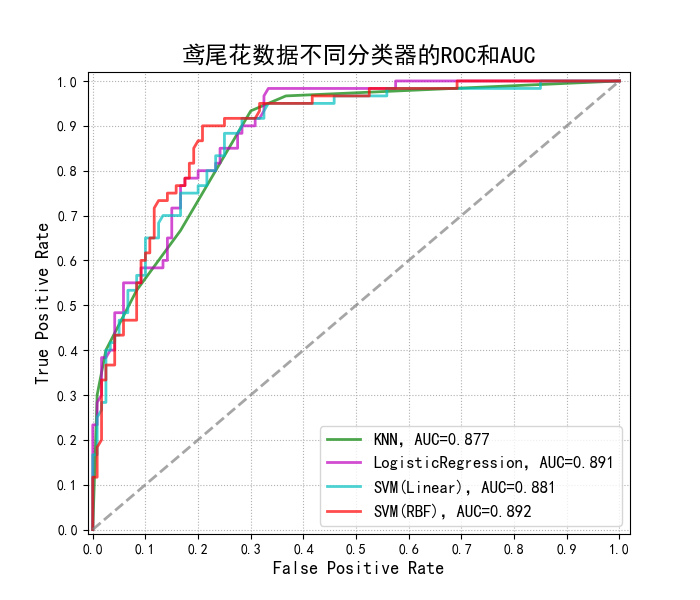

##  线性回归

- 假定误差是服从均值是0 方差为某个定值的高斯分布
- $y^{(i)}=\theta^Tx^{(i)}+\epsilon^{(i)}$
- 误差$\epsilon^{(i)}(1\leq i\leq m)是独立同分布的，服从均值为0方差为某定值、\sigma^2的高斯分布。（根据中心极限定理）$

$$
\begin{align}
p(\epsilon ^{(i)})=\frac{1}{\sqrt{2\pi}\sigma}exp\left ( -\frac{(\epsilon^{(i)})^2}{2\sigma^2} \right) \\
p(y^{(i)}|x^{(i)};\theta)=\frac{1}{\sqrt{2\pi}\sigma}exp\left ( -\frac{(y^{(i)}-\theta^Tx^{(i)})^2}{2\sigma^2} \right)
\end{align}
$$
因为$\epsilon^{(i)}$是独立同分布的，所以联合概率分布就是边缘概率分布的乘积

$$
\begin{align}
L(\theta)&=\prod_{i=1}^mp(y^{(i)}|x^{(i)};\theta) \\
&=\prod_{i=1}^m\frac{1}{\sqrt{2\pi}\sigma}exp\left (-\frac{(y^{(i)}-\theta^Tx^{(i)})^2}{2\sigma^2} \right)
\end{align}
$$

$$
\begin{align}
l(\theta)&=\log L(\theta) \\
&=m \log \frac{1}{\sqrt{2\pi}\sigma}-\frac{1}{\sigma^2} \cdot \frac{1}{2}\sum_{i=1}^m(y^{(i)}-\theta^Tx^{(i)})^2
\end{align}
$$

$$
\text{目标函数（最小二乘法）：} J(\theta)=\frac{1}{2}\sum_{i=1}^m(h_\theta(x^{(i)})-y^{(i)})^2
$$

## 正则项防止过拟合   $$\begin{cases} \lambda = 0 \\ \rho \in [0,1],\end{cases}$$

正则化即先验，

L1-norm：$$J(\vec\theta)=\frac{1}{2}\sum_{i=1}^n{(h_\theta{x^{(i)} - y^{(i)}})^2} + \lambda\sum_{j=1}^m{|\theta_j|}$$

L2-norm（认为特征是稀疏的）：$$J(\vec\theta)=\frac{1}{2}\sum_{i=1}^n{(h_\theta{x^{(i)} - y^{(i)}})^2} + \lambda\sum_{j=1}^m{\theta_j^2}$$

ElasticNet(L1 + L2):$$J(\vec\theta)=\frac{1}{2}\sum_{i=1}^n{(h_\theta{x^{(i)} - y^{(i)}})^2} + \lambda( \rho\sum_{j=1}^m{\theta_j^2} + (1-\rho)\sum_{j=1}^m{|\theta_j|})$$

### L1 正则

使参数$\theta_i$ ， $|\theta_i| < \epsilon$  $\implies$ $|\theta_i| - \epsilon < 0$  $i \in \{0,1,2\ldots n\}指样本$ 

$\text{目的是使参数$\theta$不要太大，将参数$\theta$限制在某个范围内}$

根据拉格朗日乘子法：在$|\theta_i| - \epsilon < 0$  的限制条件下 求取损失函数最小值

在原始的目标函数上加上 $\sum_{i=1}^n{\lambda_i(\theta_i-\epsilon)}$

现假定所有参数的$\lambda_i$都相同，也忽略定值$\epsilon$，那么就变为 $\lambda\sum_{j=1}^m{|\theta_j|}$

L1：$w_1=1, w_2=0.2$

L2：$w_1=1, w_2=0.04$

L4：$w_1=1, w_2=0.0016$

一般情况下使用二范数，因为二范数好计算导数

## Coefficient of Determination （决定系数）

样本总平方和（$\rm{Total\,Sum\,of\,Squares}$）：$TSS = \sum_{i=1}^n{(y_i-\bar y)^2}$

样本伪方差：$\frac{\sum_{i=1}^n{(y_i-\bar y)^2}}{m}$

残差平方和（$\rm{Resdual\,Sum\,of\,Squares}$）$RSS = \sum_{i=1}^n{(\hat y_i - y^i)^2}$

定义$R^2 = 1 - \frac{RSS}{TSS}$

- $R^2$越大，拟合效果越好
- $R^2$的最优值为1，若模型的与测试为随机值，$R^2$有可能为负
- 若预测值恒为样本期望（即$\hat y_i 恒等于 \bar y$），$R^2$为0

$ESS = \sum_{i=1}^n{(\hat y_i-\bar y)^2}$

- $TSS = ESS + RSS$   只有在$\bf 无偏估计$时上述等式才成立 否则$TSS \geq ESS + RSS$

ESS 又称回归平方和SSR（$\rm{Sum\,of\,Squares\,for\,Regression}$）

## 局部加权线性回归

## Logistic回归

Logistic回归假定数据服从二项分布 利用极大似然估计推导

### 1、Logistic/sigmoid函数

- $h_\theta(x)=g(\theta^Tx)=\frac{1}{1+e^{-\theta^Tx}}$

- $g(z)=\frac{1}{1+e^{-z}}$ 

$$
\begin{align}
g^\prime(x)&=\left( \frac{1}{1+e^{-x}} \right)^\prime=\frac{e^{-x}}{(1+e^{-x})^2} \\
&=\frac{1}{1+e^{-x}} \cdot \frac{e^{-x}}{1+e^{-x}} \\
&=g(x) \cdot (1-g(x))
\end{align}
$$

### 2、Logistic回归参数估计

Logistic回归到的参数估计用的是极大似然估计。

- 假定：$P(y=1|x;\theta)=h_\theta(x)$  

  ​           $P(y=0|x;\theta)=1-h_\theta(x)$  

$p(y|x;\theta)=(h_\theta(x))^y(1-h_\theta(x))^{1-y}$

认为$h_\theta(x)$为概率值，而且样本独立同分布

似然函数如下：
$$
\begin{align}
L(\theta)&=p(\vec y|X;\theta)\\
&=\prod_{i=1}^{m}{p(y^{(i)}|x^{(i)};\theta)} \\ 
&=\prod_{i=1}{m}{(h_\theta(x^{(i)}))^{y^{(i)}}(1-h_\theta(x^{(i)}))^{1-y^{(i)}}}
\end{align}
$$

对数似然：$l(\theta)=\log L(\theta)=\sum_{i=1}^{m}{y^{(i)}\log h(x^{(i)})+(1-y^{(i)})\log (1-h(x^{(i)}))}$  $\text{和交叉熵的形式一样}$

求偏导：
$$
\begin{align}
\frac{\partial l(\theta)}{\partial \theta}&=\sum_{i=1}^m \left ( \frac{y^{(i)}}{h(x^{(i)})}-\frac{1-y^{(i)}}{1-h(x^{(i)})} \right) \cdot \frac{\partial h(x^{(i)})}{\partial \theta} \\
&=\sum_{i=1}^{m}\left( \frac{y^{(i)}}{g(\theta^{T}x^{(i)})} - \frac{1-y^{(i)}}{1-g(\theta^{T}x^{{(i)}})} \right) \cdot \frac{\partial g(\theta^Tx^{(i)})}{\partial \theta_j} \\
&=\sum_{i=1}^{m}\left( \frac{y^{(i)}}{g(\theta^{T}x^{(i)})} - \frac{1-y^{(i)}}{1-g(\theta^{T}x^{{(i)}})} \right) \cdot g(\theta^Tx^{(i)}) \cdot (1-g(\theta^Tx^{(i)})) \cdot \frac{\partial \theta^Tx^{(i)}}{\partial \theta_j} \\
&=\sum_{i=1}^my^{(i)}(1-g(\theta^Tx^{(i)}))-(1-y^{(i)})g(\theta^Tx^{(i)}) \cdot x_j^{(i)} \\
&=\sum_{i=1}^m(y^{(i)}-g(\theta^Tx^{(i)})) \cdot x_j^{(i)} 
\end{align}
$$
Logistic回归参数学习规则（梯度下降）：
$$
\theta_j := \theta_j - \alpha (y^{(i)}-h_\theta(x^{(i)}))x_j^{(i)}
$$
二项分布、高斯分布、泊松分布、伯努利分布都属于指数族分布

## 对数线性模型

一个事件的几率$odds$，是指该事件发生的概率与该事件不发生的概率的比值。

对数几率：logit函数

$P(y=1|x;\theta) = h_\theta(x)$

$P(y=0|x;\theta) = 1- h_\theta(x)$

$\log it(p)=\log \frac {p}{1-p}=\log \frac{h_\theta(x)}{1-h_\theta(x)}=\log \left(\frac {\frac{1}{1=e^{-\theta^Tx}}}{\frac{e^{-\theta^Tx}}{1=e^{-\theta^Tx}}} \right) = \theta^Tx \,\,\,\text{是线性的}$

## 评判指标

混淆矩阵：
$$
\begin{array}{c|c}
n & \text{Positive} & \text{Negative} \\
\hline
\text{正} & TP & FN \\
\text{负} & FP & TN
\end{array}
$$

- T,F：预测True or False
- P,N：实际样本P or N

$TPR=\frac{TP}{TP+FN} $

$FPR=\frac{FP}{FP+TN}$

​	假如实际样本中正负样本各半,总样本有10个，

情况1： 所有样本都预测为正，则$TP=5, FN=0, FP=0,TN=5,TPR=1,FPR=1$

情况2： 所有样本都预测为负，则$TP=0, FN=5, FP=5,TN=0,TPR=0,FPR=0$

不同颜色的曲线为$ROC$，曲线下方面积占整体的比值为$AUC$

### 正确率（$Accuracy$）

即识别正缺的样本占总识别样本的比例

​                         $Accuracy=\frac{TP+TN}{S}$

### 错误率（$Error-rate$）

即识别错误的样本占总识别样本的比例

​                         $E = \frac{FP+FN}{S}$

### 精度（$Precision$）

识别对了的正样本占识别为正样本的比例

​						 $P=\frac{TP}{TP+FP}$

###  召回率（$Recall$）

识别正确的正样本占所有正样本的比例 						

$R=\frac{TP}{TP+FN}$

